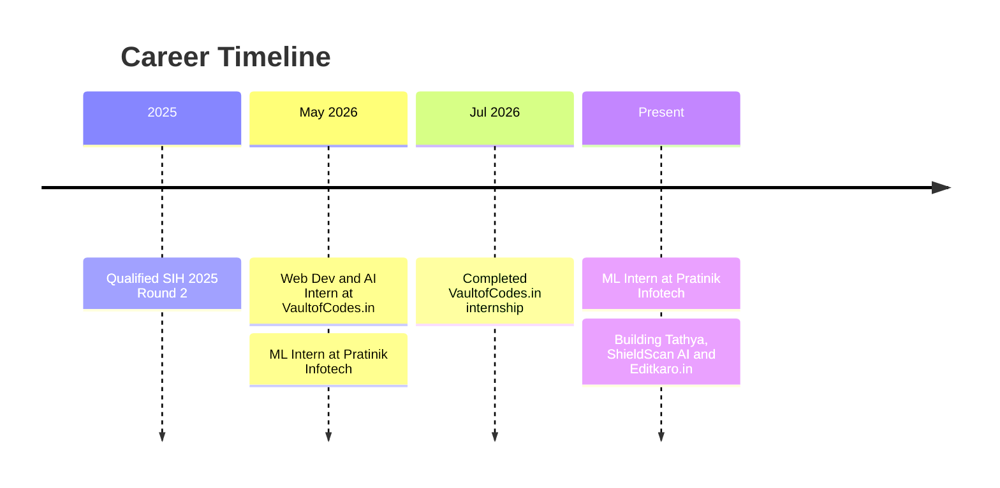
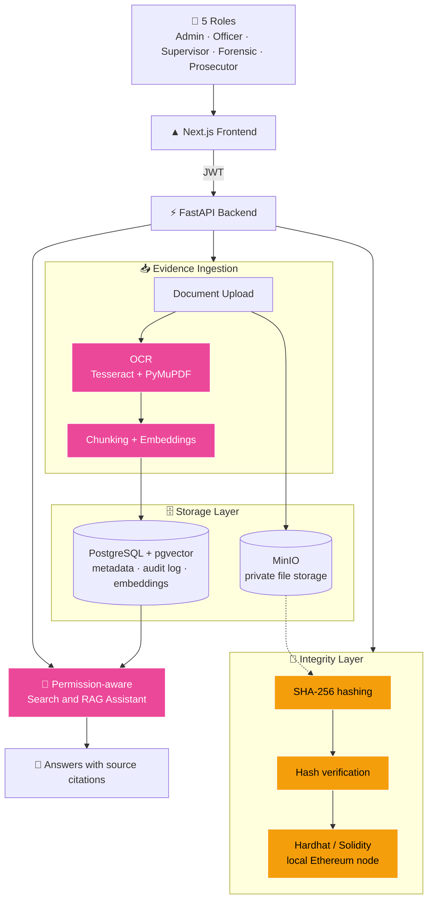
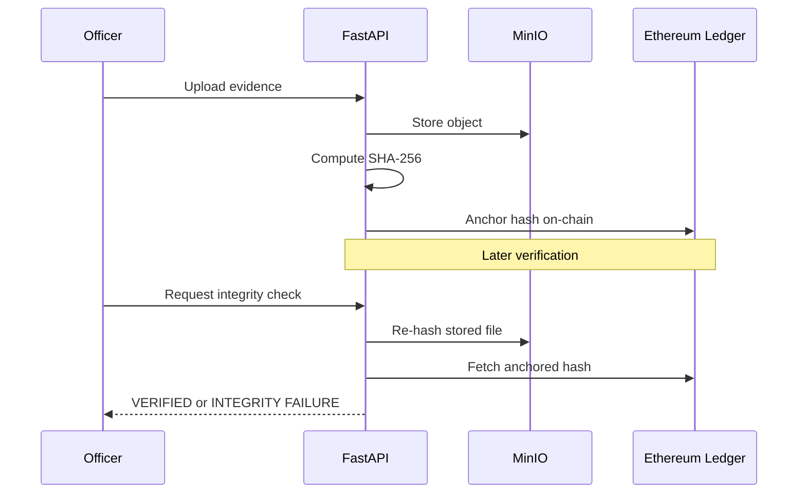
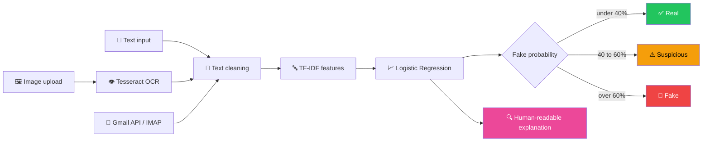
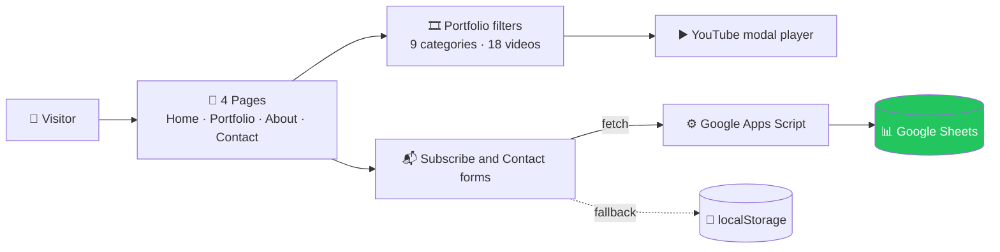
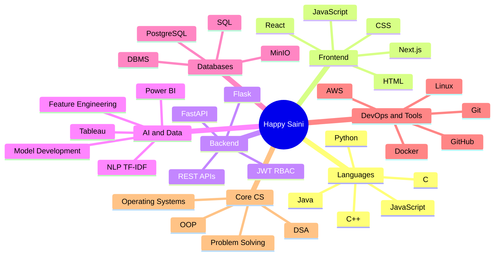

  

  

  
  
  

  
  
  
  

---

## ⚡ 30-SECOND RECRUITER SCAN

| 🎯 Target roles | 🧠 Core strengths | 🏅 Certifications |
|---|---|---|
| **ML Engineer** · **Web Developer** · **Data Analyst** | NLP (TF-IDF) · Secure backends & RBAC · Flask / FastAPI APIs · Responsive web design | AWS Cloud Practitioner · Oracle SQL · Red Hat Linux |

<table align="center">
<tr>
<td align="center"><h2>90%</h2>accuracy on <b>spam & phishing</b> detection</td>
<td align="center"><h2>5</h2>role-based access tiers in <b>Tathya</b></td>
<td align="center"><h2>18</h2>portfolio videos across <b>9 categories</b> on Editkaro.in</td>
<td align="center"><h2>SIH 2025</h2>qualified for <b>Round 2</b></td>
<td align="center"><h2>100+</h2>DSA problems on LeetCode</td>
</tr>
</table>

---

## 🧪 Experience

| Role | Company | When | What I did |
|---|---|---|---|
| **Machine Learning Intern** | Pratinik Infotech (Remote) | May 2026 – Present | Data preprocessing, feature engineering and model development; handling missing values and outliers; validation techniques and performance metrics for model evaluation; collaborating on real-world data-driven problems |
| **Web Development · Python · Java · AI Intern** | VaultofCodes.in (Remote) | May – Jul 2026 | Built responsive web pages with HTML, CSS and JavaScript; hands-on exposure to Python, Java and AI concepts; improved debugging and problem-solving through project tasks |

---

## 🏆 Achievements

### 🎖️ GitHub Achievements

  

<b>🦈 Pull Shark</b> · merged pull requests

### 🌟 Competitions & Certifications

| 🏅 | Milestone |
|:-:|---|
| 🇮🇳 | **Smart India Hackathon 2025**: qualified for the **2nd round** |
| ⚖️ | **Smart India Hackathon 2026**: built the **Tathya** prototype (PS SIH26190 · NCRB / MHA · Blockchain & Cybersecurity) |
| 🧩 | **LeetCode**: 60+ DSA problems solved |
| ☁️ | **AWS Certified Cloud Practitioner** |
| 🎓 | Oracle SQL Database · Red Hat Linux & Open Source Fundamentals · Tally Certificate · Infosys Springboard (Programming & CS Foundations) |

---

## 🚀 Projects (deep dive)

  
  
  

 

<!-- ======================= TATHYA ======================= -->
## ⚖️ Tathya · SIH 2026

> Tamper-evident platform for legal case and evidence management, with SHA-256 integrity verification, blockchain hash anchoring, audit trails and a permission-aware RAG assistant. Smart India Hackathon 2026 prototype · PS **SIH26190** · NCRB / MHA track.

**System architecture**

**Evidence verification flow**

| Highlight | Detail |
|---|---|
| 🔐 Access control | JWT + bcrypt, 5 roles, case-level RBAC enforced on the backend; unauthorized access returns 404 so document existence never leaks |
| ⛓️ Integrity | SHA-256 per document version, hashes anchored on a local Ethereum node (the document itself is never on-chain) |
| 🧠 RAG | OCR, full-text search and permission-aware retrieval with source citations |
| 🧾 Traceability | Immutable document versions and an append-only audit trail |

  

---

<!-- ======================= SHIELDSCAN ======================= -->
## 🛡️ ShieldScan AI

> AI-based web platform that classifies messages as **Real**, **Suspicious** or **Fake**, reads text from images with OCR, and scans emails automatically through Gmail API / IMAP.

| Metric | Value |
|---|---|
| Accuracy | ~90% |
| Model | TF-IDF + Logistic Regression, trained from a CSV dataset |
| Inputs | Text, images (OCR) and email scanning via Gmail API / IMAP |
| Output | Real / Suspicious / Fake label with confidence score and explanation, plus batch filtering |
| Config | Prediction thresholds adjustable in `src/config.py` |

  
  

---

<!-- ======================= EDITKARO ======================= -->
## 🎬 Editkaro.in

> Complete, responsive website for a video editing and social media marketing agency, with a filterable video portfolio and forms that save leads to Google Sheets.

| Highlight | Detail |
|---|---|
| 📱 Responsive | Mobile, tablet, laptop and desktop layouts with Flexbox, Grid and a hamburger menu |
| 🎞️ Portfolio | 18 video cards across 9 categories with live filter buttons and a YouTube embed modal |
| 📬 Lead capture | Email subscription and contact form saved to Google Sheets through Apps Script, with a localStorage fallback for local testing |
| 🔎 SEO | Meta tags, semantic HTML, alt text and lazy-loaded images |

  
  

---

## 🧠 Skills Map

  

---

## 📊 GitHub Analytics

  
  

  

  

---

## 📬 Let's talk

  

  
  

  

  

