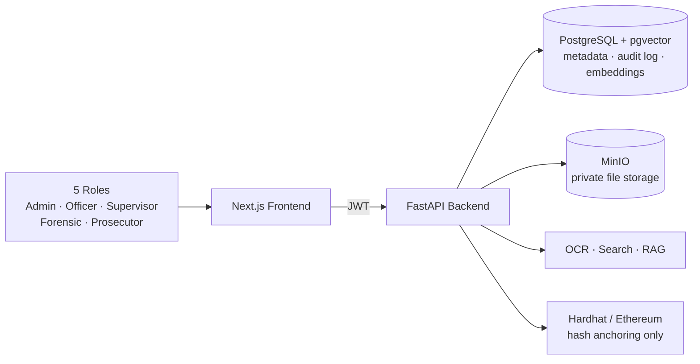
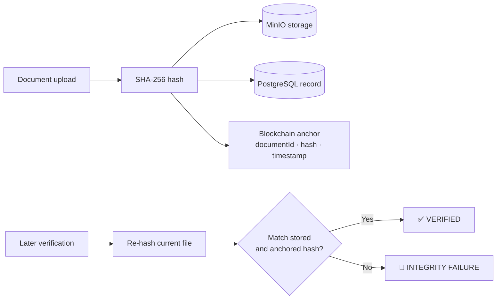
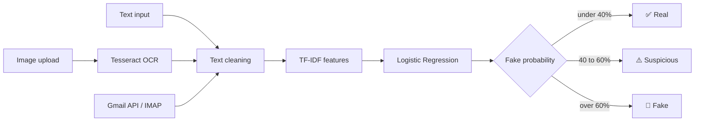
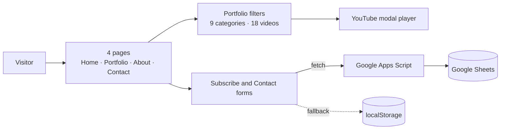
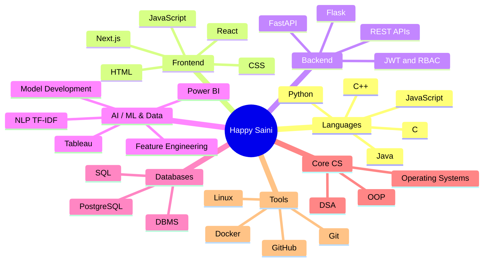

# HAPPY SAINI

### I build AI-powered web apps — from raw data to a working product ⚡

---

## ⚡ 30-SECOND RECRUITER SCAN

| 🎯 Target roles | 🧠 Core strengths | 🛠️ Stack |
|---|---|---|
| ML Engineer · Data Analyst · Full-Stack Developer | NLP (TF-IDF) · Secure backends & RBAC · Flask / FastAPI APIs · Responsive web design | Python · Flask · FastAPI · Next.js · JavaScript · SQL |

| **90%** | **5** | **3** | **SIH 2025** | **60+** |
|:---:|:---:|:---:|:---:|:---:|
| accuracy on spam / phishing detection | role-based access tiers in Tathya | featured projects below | Qualified for Round 2 | DSA problems on LeetCode |

---

## 🧪 Experience

| Role | Company | When | What I did |
|---|---|---|---|
| **Machine Learning Intern** | Pratinik Infotech (Remote) | May 2026 – Present | Data preprocessing, feature engineering and model development; handling missing values and outliers; validation techniques and performance metrics for model evaluation; collaborating on real-world data-driven problems |
| **Web Development · Python · Java · AI Intern** | VaultofCodes.in (Remote) | May – Jul 2026 | Built responsive web pages with HTML, CSS and JavaScript; hands-on exposure to Python, Java and AI concepts; improved debugging and problem-solving through project tasks |

---

## 🏆 Achievements

| 🏅 | Milestone |
|---|---|
| 🇮🇳 | **Smart India Hackathon 2025:** qualified for the 2nd round |
| ⚖️ | **Smart India Hackathon 2026:** built the Tathya prototype (PS ID SIH26190 · NCRB / MHA · Blockchain & Cybersecurity) |
| 🧩 | **LeetCode:** 60+ DSA problems solved |
| ☁️ | **AWS Certified Cloud Practitioner** |
| 🎓 | Oracle SQL Database · Red Hat Linux & Open Source Fundamentals · Tally Certificate · Infosys Springboard (Programming & CS Foundations) |

---

## 🚀 Featured Projects

### ⚖️ Tathya · SIH 2026

> Secure case, evidence and legal document management system: tamper-evident storage with SHA-256 verification, blockchain hash anchoring, audit trails and a permission-aware AI assistant. Smart India Hackathon 2026 prototype · PS ID **SIH26190** · NCRB / Ministry of Home Affairs · Blockchain & Cybersecurity.

**System architecture**

**Evidence verification flow**

| Highlight | Detail |
|---|---|
| 🔐 Access control | JWT + bcrypt, 5 roles, case-level RBAC enforced on the backend; unauthorized access returns 404 so document existence never leaks |
| ⛓️ Integrity | SHA-256 per document version, hashes anchored on a local Ethereum node (the document itself is never on-chain) |
| 🧠 AI / RAG | OCR with Tesseract + PyMuPDF, full-text search, permission-aware retrieval with source citations |
| 🧾 Traceability | Immutable document versions and an append-only audit trail |

---

### 🛡️ ShieldScan AI — Fake Message Detection Platform

> AI-based web platform that classifies messages as **Real**, **Suspicious** or **Fake**, scans text and images (OCR), and checks emails automatically.

| Metric | Value |
|---|---|
| Accuracy | ~90% |
| Model | TF-IDF + Logistic Regression, trained from a CSV dataset |
| Inputs | Text, images (OCR) and email scanning via Gmail API / IMAP |
| Output | Real / Suspicious / Fake label with confidence score and human-readable explanation, plus batch filtering |
| Config | Prediction thresholds adjustable in `src/config.py` |

---

### 🎬 Editkaro.in — Agency Website

> Complete, responsive website for a video editing and social media marketing agency, with a filterable video portfolio and forms that save leads to Google Sheets.

| Highlight | Detail |
|---|---|
| 📱 Responsive | Mobile, tablet, laptop and desktop layouts with Flexbox, Grid and a hamburger menu |
| 🎞️ Portfolio | 18 video cards across 9 categories with live filter buttons and a YouTube embed modal |
| 📬 Lead capture | Email subscription and contact form saved to Google Sheets through Apps Script, with a localStorage fallback for local testing |
| 🔎 SEO | Meta tags, semantic HTML, alt text and lazy-loaded images |

---

## 🧠 Skills Map

---

## 📊 GitHub Analytics

---

## 📬 Let's talk

### `I learn it, build it, and ship it.`

